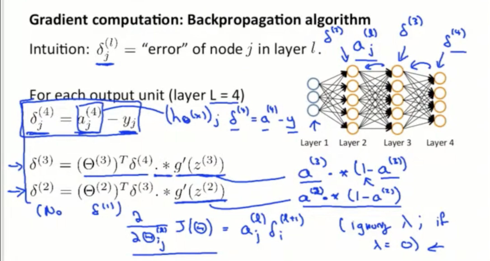
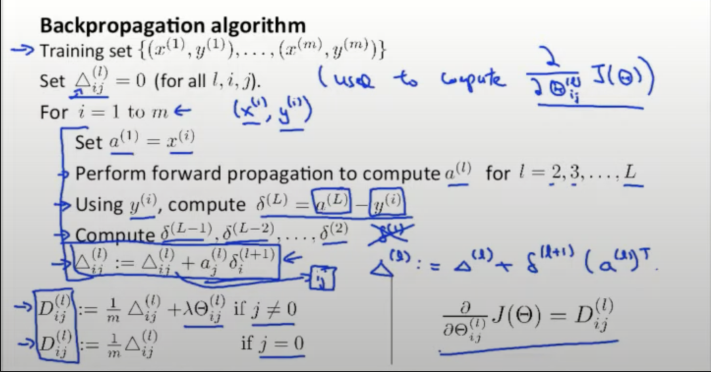

This is just for the educational purpose.

# **How does a neural network compute?**

<ul>
    <li>Step 1 Construct input vector from training data</li>
    <li>Step 2 Muliply weight matrix by column vector</li>
    <li>Apply activation function to resulting column vector</li>
</ul>
<em>Repeat for all layers untl you produce the output</em>

As you can see, the very first step, delta4 is calculating the error between the predicted value and the ground truth ones. Follwoing this, we will add bias to the previous layer output.   Then delta3 is the multiplication of the dot product of current weights_3_transpose and the next delta_4 and the current_sigmoid_gradient_z3.

As shown above, the current gradient is the dot product of the current input and the next delta.

